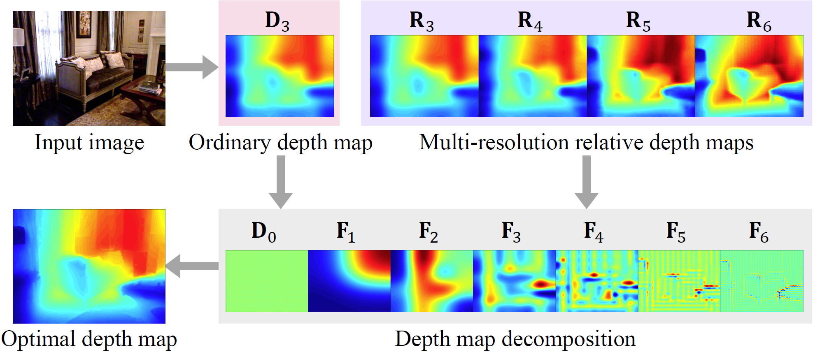

# [CVPR 2019] Monocular Depth Estimation Using Relative Depth Maps


## Paper

[**Monocular Depth Estimation Using Relative Depth Maps**](http://openaccess.thecvf.com/content_CVPR_2019/papers/Lee_Monocular_Depth_Estimation_Using_Relative_Depth_Maps_CVPR_2019_paper.pdf)
[**Supplemental Materials on Monocular Depth Estimation Using Relative Depth Maps**]
(http://openaccess.thecvf.com/content_CVPR_2019/supplemental/Lee_Monocular_Depth_Estimation_CVPR_2019_supplemental.pdf)

If you use our code or results please cite:

```
@InProceedings{Lee_2019_CVPR,
  author = {Lee, Jae-Han and Kim, Chang-Su},
  title = {Monocular Depth Estimation Using Relative Depth Maps}, 
  booktitle = {The IEEE Conference on Computer Vision and Pattern Recognition (CVPR)},
  month = {June},
  year = {2019}
}
```
